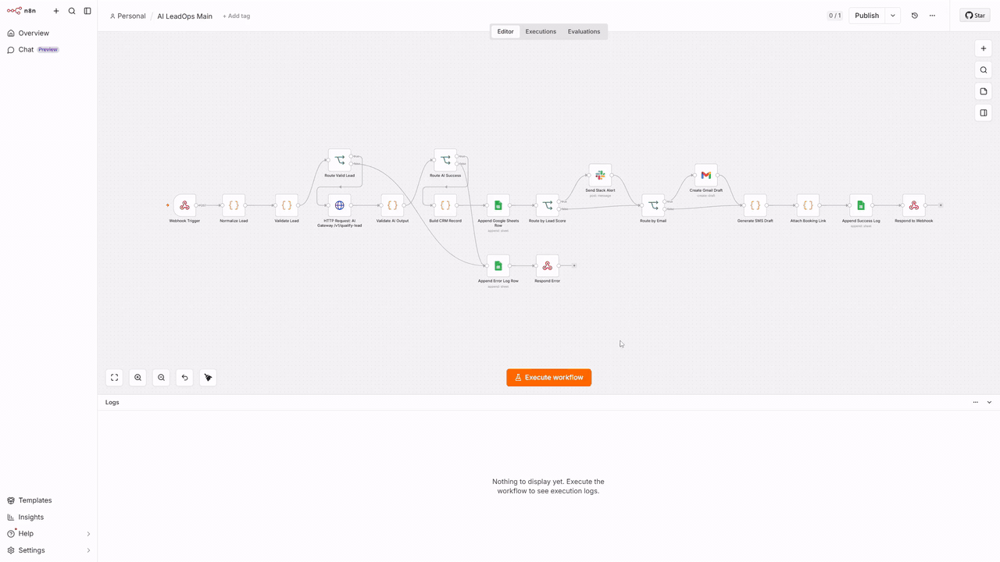

<div align="center">
  <h1>AI LeadOps Automation</h1>
  
  <p>
    
  </p>
  
  <p>AI LeadOps Automation: local n8n delivery package for inbound lead intake, AI qualification, CRM-style rows, follow-up drafts, high-priority Slack alerts, booking links, execution logs, error logs, and daily summaries.</p>

  <p>Main workflow dependencies: Google Sheets, Slack, and Gmail credentials in n8n. Demo workflow purpose: credential-free data shape review before external service setup.</p>

</div>

## Contents

- AI Gateway with deterministic `mock`, official OpenAI, official Anthropic, and generic OpenAI-compatible providers.
- Raw website form, paid ad, and missed call transcript payloads.
- Raw payload normalization in n8n before AI Gateway calls.
- Schema validation for lead input, AI output, CRM records, and error responses.
- Credential-free demo workflow for local review.
- Main workflow for CRM rows, Slack alerts, Gmail drafts, SMS drafts, booking links, and logs.
- Error handler workflow for runtime failures.
- Daily summary workflow for lead totals, priority breakdowns, errors, pending follow-ups, and top sources.

## Repository Layout

```text
apps/ai-gateway/       Fastify AI Gateway and tests
docs/                  Setup, architecture, workflow, and extension docs
examples/inputs/       Raw and normalized sample payloads
examples/outputs/      Sample AI and error outputs
examples/curl/         Demo webhook curl scripts
schemas/               JSON Schema contracts
workflows/n8n/         n8n workflow exports
```

## Quick Start

[Setup](docs/setup.md): usage guide for first run, n8n import, credentials, and main workflow verification.

[Configuration](docs/configuration.md): configuration reference for environment variables and credentials.

[Testing](docs/testing.md): verification guide for local checks and expected results.

## Delivery Workflow

Main delivery path:

- Payload normalization for website forms, paid ads, and missed calls.
- AI Gateway lead qualification.
- Google Sheets CRM rows and execution logs.
- Slack alerts for high-priority leads.
- Gmail drafts for leads with email addresses.
- SMS draft text for leads with phone numbers.
- Booking links for consultation leads.
- `ErrorLogs` coverage for validation and runtime failures.

Credential location: n8n. Secret storage: outside the repository.

## AI Providers

Provider options: `mock`, `openai`, `anthropic`, and `openai-compatible`.

Provider switching scope: AI Gateway environment variables only. n8n workflow edits: not required for provider changes.

## Validation

Validation coverage: formatting, lint, tests, AI Gateway build, workflow JSON parsing, and n8n smoke tests.

[Testing](docs/testing.md): verification commands and expected results. Pre-commit hook: staged file checks before commits.

## Documentation

Documentation purpose: user guidance, configuration reference, provider integration notes, workflow behavior reference, data contracts, verification reference, troubleshooting reference, and development boundaries.

Documentation map:

- [Setup](docs/setup.md): usage guide for first run, n8n import, credentials, and main workflow verification.
- [Configuration](docs/configuration.md): configuration reference for environment variables, ports, and credentials.
- [AI Providers](docs/ai-providers.md): provider integration reference for model selection and official API behavior.
- [Architecture](docs/development/architecture.md): developer reference for system boundaries and data flow.
- [Workflow Reference](docs/workflow-reference.md): n8n workflow reference for nodes, dependencies, and webhook behavior.
- [Prompt Guide](docs/prompt-guide.md): prompt contract for lead qualification output.
- [Schemas](docs/schemas.md): data contract reference for JSON Schema files and schema updates.
- [Error Handling](docs/error-handling.md): failure behavior reference for error codes, severity, and recovery paths.
- [Testing](docs/testing.md): verification guide for local checks, smoke tests, and evidence.
- [Extension Guide](docs/extension-guide.md): development guide for supported extension points and change boundaries.
- [Troubleshooting](docs/troubleshooting.md): support guide for common setup and runtime failures.
